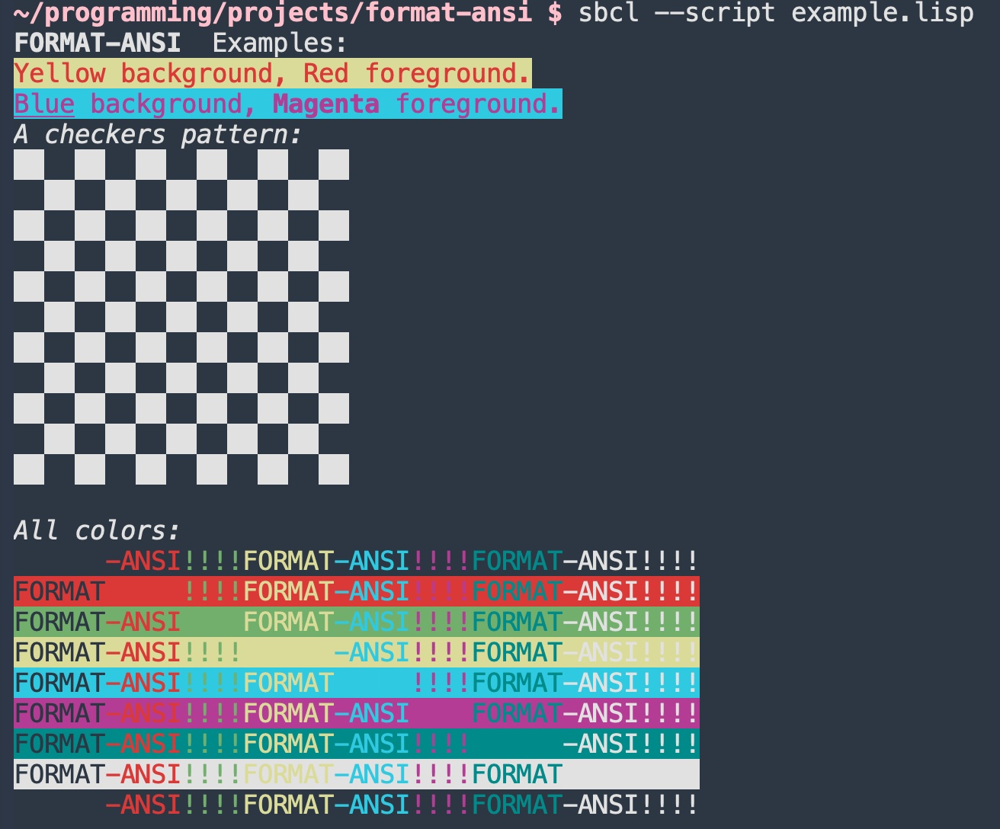

# Format-Ansi

Basic functionality to format text with ANSI colors and styles.

This library is focused on performance and usability.
It provides an API similar to `CL:FORMAT` which allows for efficient output and is easy to remember.

## Usage

* Basic string argument, setting background, foreground and style:

```lisp
(ansi:format-ansi T "Example"
                  :bg :blue
                  :fg :yellow 
                  :st :bold)
```


* List of arguments, each with its own style:

```lisp
(ansi:format-ansi T '((:bg :magenta "HELLO") (:fg :red "BYE!")))
```


* Both list of arguments with styles and _outer_ styles:

```lisp
(ansi:format-ansi T '((:st :bold "HELLO") " there") :bg :green)
```


To see all available named colors and styles, run:

```lisp
CL-USER> (mapcar #'(lambda (e) (car e))
                 ansi::*bg-colors*)
(:BLACK :RED :GREEN :YELLOW :BLUE :MAGENTA :CYAN :WHITE :RESET)
CL-USER> (mapcar #'(lambda (e) (car e))
                 ansi::*styles*)
(:BOLD :DIM :ITALIC :UNDERLINE :BLINK :NEGATIVE :HIDDEN :CROSS-OUT :NORMAL
 :NO-UNDERLINE :POSITIVE :VISIBLE :NO-CROSS-OUT)
```

* some samples from [example.lisp](example.lisp) as seen on eshell:



## 256 colors

Besides named colors, format-ansi also supports 256-integer colors:

```lisp
(ansi:format-ansi T "256 colors!" :bg 226 :fg 196)
```

Here's how to print all the integer colors:

```lisp
(loop for c from 0 to 255
      do (format-ansi T (format nil "~8:@<~A~>" c)
                      :bg c
                      :fg (- 255 c))
         (when (zerop (mod (1+ c) 8)) (newline)))
```

Output (on MacOS Terminal):


## Installation

Load the ASD file, then run `(ql:quickload "format-ansi")`.

## Building and Testing

Run from a terminal:

```shell
# compile with warnings enabled
./build.sh

# run all tests
./test.sh
```

Run from the REPL:

```lisp
;; load
(ql:quickload "format-ansi/tests")

;; run all tests
(parachute:test :format-ansi/tests)

;; run individual test
(parachute:test 'format-ansi/tests::no-args)
```
